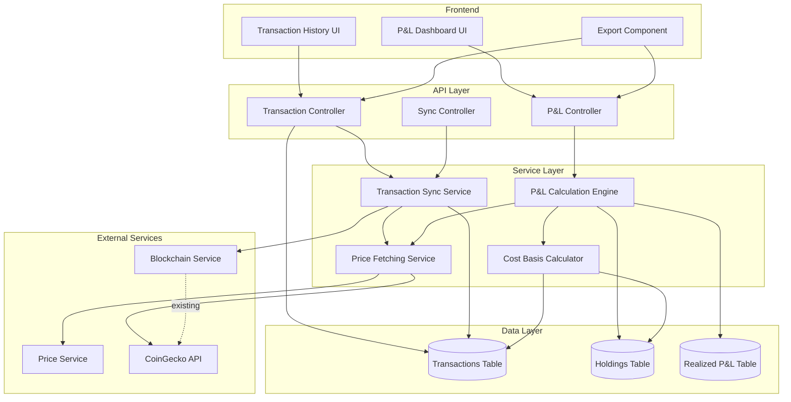

# Design Document: Transaction Tracking and P&L Calculator

## Overview

This feature adds comprehensive transaction tracking and profit/loss calculation to the Web3 crypto portfolio tracker. The system fetches transactions from connected wallets and exchanges, stores them with complete metadata, calculates cost basis using multiple methods (FIFO, LIFO, Weighted Average), and computes both realized and unrealized P&L.

The design follows a layered architecture:
- **Data Layer**: Prisma-based database schema for transactions, holdings, and P&L records
- **Service Layer**: Transaction sync service, P&L calculation engine, and price fetching service
- **API Layer**: RESTful endpoints for transaction retrieval, P&L queries, and sync operations
- **Frontend Layer**: React components for transaction history, P&L dashboard, and data export

Key design principles:
- **Precision-first**: All financial calculations use fixed-point decimal arithmetic (no floating-point)
- **Idempotency**: Transaction syncs can be safely repeated without creating duplicates
- **Extensibility**: Cost-basis methods are pluggable for future additions
- **Integration**: Leverages existing authentication, blockchain service, and price service

## Architecture

### System Components



### Data Flow

**Transaction Sync Flow:**
1. User triggers sync via POST /transactions/sync
2. Sync Controller validates request and checks for concurrent syncs
3. Transaction Sync Service fetches transactions from Blockchain Service
4. For each transaction, Price Fetching Service retrieves historical price
5. Transactions are normalized to USD and stored in database
6. Duplicate detection prevents re-insertion of existing transactions
7. Holdings are recalculated based on new transactions

**P&L Calculation Flow:**
1. User requests P&L via GET /pnl/summary
2. P&L Controller retrieves user's cost-basis method preference
3. P&L Calculation Engine loads all transactions chronologically
4. Cost Basis Calculator applies selected method (FIFO/LIFO/Weighted Average)
5. For realized P&L: matches sells/swaps against cost basis
6. For unrealized P&L: fetches current prices and compares to cost basis
7. Results are aggregated and returned to frontend

## Components and Interfaces

### Database Schema

**Transactions Table:**
```typescript
model Transaction {
  id            String   @id @default(cuid())
  userId        String
  walletAddress String
  chain         String   // e.g., "ethereum", "polygon"
  tokenSymbol   String   // e.g., "ETH", "USDC"
  txType        String   // "buy", "sell", "swap", "transfer", "fee"
  quantity      Decimal  @db.Decimal(36, 18) // 18 decimal precision
  priceUsd      Decimal  @db.Decimal(20, 8)  // 8 decimal precision for USD
  feeAmount     Decimal? @db.Decimal(36, 18)
  feeToken      String?
  timestamp     DateTime
  txHash        String
  source        String   // "wallet" or "exchange"
  createdAt     DateTime @default(now())
  
  user          User     @relation(fields: [userId], references: [id])
  
  @@unique([userId, txHash, walletAddress])
  @@index([userId, tokenSymbol, timestamp])
  @@index([userId, walletAddress])
}
```

**Holdings Table:**
```typescript
model Holding {
  id              String   @id @default(cuid())
  userId          String
  walletAddress   String
  tokenSymbol     String
  quantity        Decimal  @db.Decimal(36, 18)
  costBasisUsd    Decimal  @db.Decimal(20, 8)
  costBasisMethod String   // "FIFO", "LIFO", "WEIGHTED_AVERAGE"
  lastUpdated     DateTime @default(now())
  
  user            User     @relation(fields: [userId], references: [id])
  
  @@unique([userId, walletAddress, tokenSymbol, costBasisMethod])
  @@index([userId, tokenSymbol])
}
```

**Realized P&L Table:**
```typescript
model RealizedPnL {
  id                String      @id @default(cuid())
  userId            String
  tokenSymbol       String
  realizedAmountUsd Decimal     @db.Decimal(20, 8)
  transactionId     String
  calculatedAt      DateTime    @default(now())
  
  user              User        @relation(fields: [userId], references: [id])
  transaction       Transaction @relation(fields: [transactionId], references: [id])
  
  @@index([userId, tokenSymbol])
}
```

**User Preferences Extension:**
```typescript
// Add to existing User model
model User {
  // ... existing fields
  costBasisMethod String @default("FIFO") // "FIFO", "LIFO", "WEIGHTED_AVERAGE"
}
```

### API Endpoints

**Transaction Endpoints:**

```typescript
// GET /api/transactions
interface GetTransactionsRequest {
  page?: number;
  limit?: number;
  startDate?: string; // ISO 8601
  endDate?: string;
  tokenSymbol?: string;
  txType?: "buy" | "sell" | "swap" | "transfer" | "fee";
  walletAddress?: string;
  sortBy?: "timestamp" | "priceUsd" | "quantity";
  sortOrder?: "asc" | "desc";
}

interface GetTransactionsResponse {
  transactions: Transaction[];
  total: number;
  page: number;
  limit: number;
}

// POST /api/transactions/sync
interface SyncTransactionsRequest {
  walletAddresses?: string[]; // Optional: sync specific wallets only
}

interface SyncTransactionsResponse {
  success: boolean;
  newTransactionsCount: number;
  updatedHoldings: number;
  errors?: {
    walletAddress: string;
    error: string;
  }[];
}
```

**P&L Endpoints:**

```typescript
// GET /api/pnl/realized
interface GetRealizedPnLRequest {
  startDate?: string;
  endDate?: string;
  tokenSymbol?: string;
}

interface GetRealizedPnLResponse {
  totalRealizedPnL: string; // Decimal as string
  byToken: {
    tokenSymbol: string;
    realizedPnL: string;
    transactionCount: number;
  }[];
}

// GET /api/pnl/unrealized
interface GetUnrealizedPnLRequest {
  tokenSymbol?: string;
}

interface GetUnrealizedPnLResponse {
  totalUnrealizedPnL: string;
  holdings: {
    tokenSymbol: string;
    quantity: string;
    costBasis: string;
    currentValue: string;
    unrealizedPnL: string;
    percentageGain: string;
  }[];
}

// GET /api/pnl/summary
interface GetPnLSummaryResponse {
  totalRealizedPnL: string;
  totalUnrealizedPnL: string;
  totalPnL: string;
  costBasisMethod: string;
  byToken: {
    tokenSymbol: string;
    holdings: string;
    costBasis: string;
    currentValue: string;
    unrealizedPnL: string;
    realizedPnL: string;
    totalPnL: string;
    percentageGain: string;
  }[];
}
```

### Service Layer

**Transaction Sync Service:**

```typescript
class TransactionSyncService {
  private blockchainService: BlockchainService;
  private priceService: PriceFetchingService;
  private prisma: PrismaClient;
  private activeSyncs: Map<string, Promise<void>>;
  
  async syncWalletTransactions(
    userId: string,
    walletAddress: string
  ): Promise<SyncResult> {
    // Check for concurrent sync
    if (this.activeSyncs.has(walletAddress)) {
      throw new Error("Sync already in progress for this wallet");
    }
    
    try {
      // Mark sync as active
      const syncPromise = this.performSync(userId, walletAddress);
      this.activeSyncs.set(walletAddress, syncPromise);
      
      return await syncPromise;
    } finally {
      this.activeSyncs.delete(walletAddress);
    }
  }
  
  private async performSync(
    userId: string,
    walletAddress: string
  ): Promise<SyncResult> {
    // Fetch transactions from blockchain
    const rawTransactions = await this.blockchainService.getTransactions(
      walletAddress
    );
    
    let newCount = 0;
    
    for (const rawTx of rawTransactions) {
      // Check for duplicate
      const exists = await this.prisma.transaction.findUnique({
        where: {
          userId_txHash_walletAddress: {
            userId,
            txHash: rawTx.hash,
            walletAddress
          }
        }
      });
      
      if (exists) continue;
      
      // Fetch historical price
      const price = await this.priceService.getHistoricalPrice(
        rawTx.tokenSymbol,
        rawTx.timestamp
      );
      
      // Store transaction
      await this.prisma.transaction.create({
        data: {
          userId,
          walletAddress,
          chain: rawTx.chain,
          tokenSymbol: rawTx.tokenSymbol,
          txType: this.classifyTransaction(rawTx),
          quantity: new Decimal(rawTx.quantity),
          priceUsd: new Decimal(price),
          feeAmount: rawTx.fee ? new Decimal(rawTx.fee) : null,
          feeToken: rawTx.feeToken,
          timestamp: rawTx.timestamp,
          txHash: rawTx.hash,
          source: "wallet"
        }
      });
      
      newCount++;
    }
    
    // Recalculate holdings
    await this.recalculateHoldings(userId);
    
    return { newTransactionsCount: newCount };
  }
  
  private classifyTransaction(rawTx: any): string {
    // Logic to determine if transaction is buy, sell, swap, transfer, or fee
    // Based on transaction data from blockchain
    if (rawTx.to === rawTx.from) return "transfer";
    if (rawTx.value === "0") return "fee";
    // Additional classification logic...
    return "buy";
  }
  
  private async recalculateHoldings(userId: string): Promise<void> {
    // Recalculate holdings for all tokens
    // This will be called by P&L calculation engine
  }
}
```

**P&L Calculation Engine:**

```typescript
class PnLCalculationEngine {
  private costBasisCalculator: CostBasisCalculator;
  private priceService: PriceFetchingService;
  private prisma: PrismaClient;
  
  async calculateRealizedPnL(
    userId: string,
    options?: { startDate?: Date; endDate?: Date; tokenSymbol?: string }
  ): Promise<RealizedPnLResult> {
    // Get user's cost basis method
    const user = await this.prisma.user.findUnique({
      where: { id: userId },
      select: { costBasisMethod: true }
    });
    
    const method = user?.costBasisMethod || "FIFO";
    
    // Get all sell and swap transactions
    const transactions = await this.prisma.transaction.findMany({
      where: {
        userId,
        txType: { in: ["sell", "swap"] },
        timestamp: {
          gte: options?.startDate,
          lte: options?.endDate
        },
        tokenSymbol: options?.tokenSymbol
      },
      orderBy: { timestamp: "asc" }
    });
    
    const pnlByToken = new Map<string, Decimal>();
    
    for (const tx of transactions) {
      // Calculate realized P&L for this transaction
      const costBasis = await this.costBasisCalculator.getCostBasis(
        userId,
        tx.tokenSymbol,
        tx.quantity,
        tx.timestamp,
        method
      );
      
      const proceeds = tx.priceUsd.mul(tx.quantity);
      const cost = costBasis.mul(tx.quantity);
      const fees = tx.feeAmount 
        ? tx.priceUsd.mul(tx.feeAmount) 
        : new Decimal(0);
      
      const realizedPnL = proceeds.minus(cost).minus(fees);
      
      // Accumulate by token
      const current = pnlByToken.get(tx.tokenSymbol) || new Decimal(0);
      pnlByToken.set(tx.tokenSymbol, current.plus(realizedPnL));
      
      // Store in database
      await this.prisma.realizedPnL.create({
        data: {
          userId,
          tokenSymbol: tx.tokenSymbol,
          realizedAmountUsd: realizedPnL,
          transactionId: tx.id
        }
      });
    }
    
    return {
      totalRealizedPnL: Array.from(pnlByToken.values())
        .reduce((sum, val) => sum.plus(val), new Decimal(0)),
      byToken: Array.from(pnlByToken.entries()).map(([symbol, pnl]) => ({
        tokenSymbol: symbol,
        realizedPnL: pnl
      }))
    };
  }
  
  async calculateUnrealizedPnL(
    userId: string,
    options?: { tokenSymbol?: string }
  ): Promise<UnrealizedPnLResult> {
    // Get user's cost basis method
    const user = await this.prisma.user.findUnique({
      where: { id: userId },
      select: { costBasisMethod: true }
    });
    
    const method = user?.costBasisMethod || "FIFO";
    
    // Get current holdings
    const holdings = await this.prisma.holding.findMany({
      where: {
        userId,
        costBasisMethod: method,
        tokenSymbol: options?.tokenSymbol,
        quantity: { gt: 0 }
      }
    });
    
    const results = [];
    let totalUnrealizedPnL = new Decimal(0);
    
    for (const holding of holdings) {
      // Fetch current price
      const currentPrice = await this.priceService.getCurrentPrice(
        holding.tokenSymbol
      );
      
      if (!currentPrice) {
        // Skip if price unavailable
        continue;
      }
      
      const currentValue = new Decimal(currentPrice).mul(holding.quantity);
      const costBasis = holding.costBasisUsd;
      const unrealizedPnL = currentValue.minus(costBasis);
      const percentageGain = costBasis.isZero() 
        ? new Decimal(0)
        : unrealizedPnL.div(costBasis).mul(100);
      
      totalUnrealizedPnL = totalUnrealizedPnL.plus(unrealizedPnL);
      
      results.push({
        tokenSymbol: holding.tokenSymbol,
        quantity: holding.quantity,
        costBasis,
        currentValue,
        unrealizedPnL,
        percentageGain
      });
    }
    
    return {
      totalUnrealizedPnL,
      holdings: results
    };
  }
}
```

**Cost Basis Calculator:**

```typescript
interface CostBasisMethod {
  calculate(
    purchases: Purchase[],
    sellQuantity: Decimal
  ): { costBasis: Decimal; remainingPurchases: Purchase[] };
}

class FIFOMethod implements CostBasisMethod {
  calculate(
    purchases: Purchase[],
    sellQuantity: Decimal
  ): { costBasis: Decimal; remainingPurchases: Purchase[] } {
    let remaining = sellQuantity;
    let totalCost = new Decimal(0);
    const updatedPurchases = [...purchases];
    
    for (let i = 0; i < updatedPurchases.length && remaining.gt(0); i++) {
      const purchase = updatedPurchases[i];
      const quantityToUse = Decimal.min(purchase.quantity, remaining);
      
      totalCost = totalCost.plus(
        purchase.priceUsd.mul(quantityToUse)
      );
      
      remaining = remaining.minus(quantityToUse);
      updatedPurchases[i] = {
        ...purchase,
        quantity: purchase.quantity.minus(quantityToUse)
      };
    }
    
    // Remove depleted purchases
    const remainingPurchases = updatedPurchases.filter(p => p.quantity.gt(0));
    
    const avgCostBasis = sellQuantity.isZero() 
      ? new Decimal(0)
      : totalCost.div(sellQuantity);
    
    return { costBasis: avgCostBasis, remainingPurchases };
  }
}

class LIFOMethod implements CostBasisMethod {
  calculate(
    purchases: Purchase[],
    sellQuantity: Decimal
  ): { costBasis: Decimal; remainingPurchases: Purchase[] } {
    let remaining = sellQuantity;
    let totalCost = new Decimal(0);
    const updatedPurchases = [...purchases];
    
    // Process from end (most recent) to beginning
    for (let i = updatedPurchases.length - 1; i >= 0 && remaining.gt(0); i--) {
      const purchase = updatedPurchases[i];
      const quantityToUse = Decimal.min(purchase.quantity, remaining);
      
      totalCost = totalCost.plus(
        purchase.priceUsd.mul(quantityToUse)
      );
      
      remaining = remaining.minus(quantityToUse);
      updatedPurchases[i] = {
        ...purchase,
        quantity: purchase.quantity.minus(quantityToUse)
      };
    }
    
    const remainingPurchases = updatedPurchases.filter(p => p.quantity.gt(0));
    
    const avgCostBasis = sellQuantity.isZero()
      ? new Decimal(0)
      : totalCost.div(sellQuantity);
    
    return { costBasis: avgCostBasis, remainingPurchases };
  }
}

class WeightedAverageMethod implements CostBasisMethod {
  calculate(
    purchases: Purchase[],
    sellQuantity: Decimal
  ): { costBasis: Decimal; remainingPurchases: Purchase[] } {
    // Calculate total quantity and total cost
    let totalQuantity = new Decimal(0);
    let totalCost = new Decimal(0);
    
    for (const purchase of purchases) {
      totalQuantity = totalQuantity.plus(purchase.quantity);
      totalCost = totalCost.plus(
        purchase.priceUsd.mul(purchase.quantity)
      );
    }
    
    if (totalQuantity.isZero()) {
      return { costBasis: new Decimal(0), remainingPurchases: [] };
    }
    
    // Calculate weighted average price
    const avgPrice = totalCost.div(totalQuantity);
    
    // Reduce all purchases proportionally
    const remainingQuantity = totalQuantity.minus(sellQuantity);
    const remainingPurchases = purchases.map(p => ({
      ...p,
      quantity: p.quantity.mul(remainingQuantity).div(totalQuantity),
      priceUsd: avgPrice // Update to weighted average
    })).filter(p => p.quantity.gt(0));
    
    return { costBasis: avgPrice, remainingPurchases };
  }
}

class CostBasisCalculator {
  private methods: Map<string, CostBasisMethod>;
  private prisma: PrismaClient;
  
  constructor() {
    this.methods = new Map([
      ["FIFO", new FIFOMethod()],
      ["LIFO", new LIFOMethod()],
      ["WEIGHTED_AVERAGE", new WeightedAverageMethod()]
    ]);
  }
  
  async getCostBasis(
    userId: string,
    tokenSymbol: string,
    sellQuantity: Decimal,
    sellTimestamp: Date,
    method: string
  ): Promise<Decimal> {
    // Get all buy transactions before this sell
    const purchases = await this.prisma.transaction.findMany({
      where: {
        userId,
        tokenSymbol,
        txType: { in: ["buy", "swap"] },
        timestamp: { lt: sellTimestamp }
      },
      orderBy: { timestamp: "asc" }
    });
    
    // Convert to Purchase objects
    const purchaseList: Purchase[] = purchases.map(tx => ({
      quantity: tx.quantity,
      priceUsd: tx.priceUsd,
      timestamp: tx.timestamp
    }));
    
    // Apply cost basis method
    const calculator = this.methods.get(method);
    if (!calculator) {
      throw new Error(`Unknown cost basis method: ${method}`);
    }
    
    const result = calculator.calculate(purchaseList, sellQuantity);
    
    return result.costBasis;
  }
  
  async updateHoldings(
    userId: string,
    tokenSymbol: string,
    method: string
  ): Promise<void> {
    // Get all transactions for this token
    const transactions = await this.prisma.transaction.findMany({
      where: { userId, tokenSymbol },
      orderBy: { timestamp: "asc" }
    });
    
    let purchases: Purchase[] = [];
    let totalQuantity = new Decimal(0);
    
    for (const tx of transactions) {
      if (tx.txType === "buy") {
        purchases.push({
          quantity: tx.quantity,
          priceUsd: tx.priceUsd,
          timestamp: tx.timestamp
        });
        totalQuantity = totalQuantity.plus(tx.quantity);
      } else if (tx.txType === "sell" || tx.txType === "swap") {
        const calculator = this.methods.get(method)!;
        const result = calculator.calculate(purchases, tx.quantity);
        purchases = result.remainingPurchases;
        totalQuantity = totalQuantity.minus(tx.quantity);
      }
      // Transfers don't affect cost basis
    }
    
    // Calculate total cost basis
    let totalCostBasis = new Decimal(0);
    for (const purchase of purchases) {
      totalCostBasis = totalCostBasis.plus(
        purchase.priceUsd.mul(purchase.quantity)
      );
    }
    
    // Update or create holding
    await this.prisma.holding.upsert({
      where: {
        userId_walletAddress_tokenSymbol_costBasisMethod: {
          userId,
          walletAddress: "aggregated", // Aggregate across wallets
          tokenSymbol,
          costBasisMethod: method
        }
      },
      update: {
        quantity: totalQuantity,
        costBasisUsd: totalCostBasis,
        lastUpdated: new Date()
      },
      create: {
        userId,
        walletAddress: "aggregated",
        tokenSymbol,
        quantity: totalQuantity,
        costBasisUsd: totalCostBasis,
        costBasisMethod: method
      }
    });
  }
}
```

**Price Fetching Service:**

```typescript
class PriceFetchingService {
  private priceService: ExistingPriceService;
  private cache: Map<string, { price: Decimal; timestamp: Date }>;
  
  async getHistoricalPrice(
    tokenSymbol: string,
    timestamp: Date
  ): Promise<Decimal> {
    const cacheKey = `${tokenSymbol}-${timestamp.toISOString()}`;
    
    // Check cache
    if (this.cache.has(cacheKey)) {
      return this.cache.get(cacheKey)!.price;
    }
    
    // Fetch from price service
    const price = await this.priceService.getHistoricalPrice(
      tokenSymbol,
      timestamp
    );
    
    if (!price) {
      // Try to find closest price within 24 hours
      const dayBefore = new Date(timestamp.getTime() - 24 * 60 * 60 * 1000);
      const dayAfter = new Date(timestamp.getTime() + 24 * 60 * 60 * 1000);
      
      const closestPrice = await this.priceService.getClosestPrice(
        tokenSymbol,
        timestamp,
        dayBefore,
        dayAfter
      );
      
      if (!closestPrice) {
        throw new Error(
          `No historical price found for ${tokenSymbol} at ${timestamp}`
        );
      }
      
      // Cache and return
      this.cache.set(cacheKey, { 
        price: new Decimal(closestPrice), 
        timestamp 
      });
      return new Decimal(closestPrice);
    }
    
    // Cache and return
    const decimalPrice = new Decimal(price);
    this.cache.set(cacheKey, { price: decimalPrice, timestamp });
    return decimalPrice;
  }
  
  async getCurrentPrice(tokenSymbol: string): Promise<Decimal | null> {
    try {
      const price = await this.priceService.getCurrentPrice(tokenSymbol);
      return price ? new Decimal(price) : null;
    } catch (error) {
      console.error(`Failed to fetch current price for ${tokenSymbol}:`, error);
      return null;
    }
  }
}
```

## Data Models

**Core Types:**

```typescript
interface Transaction {
  id: string;
  userId: string;
  walletAddress: string;
  chain: string;
  tokenSymbol: string;
  txType: "buy" | "sell" | "swap" | "transfer" | "fee";
  quantity: Decimal;
  priceUsd: Decimal;
  feeAmount?: Decimal;
  feeToken?: string;
  timestamp: Date;
  txHash: string;
  source: "wallet" | "exchange";
  createdAt: Date;
}

interface Holding {
  id: string;
  userId: string;
  walletAddress: string;
  tokenSymbol: string;
  quantity: Decimal;
  costBasisUsd: Decimal;
  costBasisMethod: "FIFO" | "LIFO" | "WEIGHTED_AVERAGE";
  lastUpdated: Date;
}

interface RealizedPnL {
  id: string;
  userId: string;
  tokenSymbol: string;
  realizedAmountUsd: Decimal;
  transactionId: string;
  calculatedAt: Date;
}

interface Purchase {
  quantity: Decimal;
  priceUsd: Decimal;
  timestamp: Date;
}

interface SyncResult {
  newTransactionsCount: number;
  updatedHoldings?: number;
}

interface RealizedPnLResult {
  totalRealizedPnL: Decimal;
  byToken: {
    tokenSymbol: string;
    realizedPnL: Decimal;
  }[];
}

interface UnrealizedPnLResult {
  totalUnrealizedPnL: Decimal;
  holdings: {
    tokenSymbol: string;
    quantity: Decimal;
    costBasis: Decimal;
    currentValue: Decimal;
    unrealizedPnL: Decimal;
    percentageGain: Decimal;
  }[];
}
```


## Correctness Properties

*A property is a characteristic or behavior that should hold true across all valid executions of a system—essentially, a formal statement about what the system should do. Properties serve as the bridge between human-readable specifications and machine-verifiable correctness guarantees.*

### Property 1: Transaction Data Completeness
*For any* transaction stored in the system, all required fields (wallet address, chain, token symbol, transaction type, quantity, price, timestamp, hash, and source) should be present and non-null.
**Validates: Requirements 1.1**

### Property 2: USD Normalization Consistency
*For any* transaction or price data stored in the system, all monetary values should be normalized to USD regardless of the original currency or token.
**Validates: Requirements 1.3, 3.2**

### Property 3: Transaction Idempotency
*For any* transaction with a given hash and wallet address combination, attempting to store it multiple times should result in exactly one record in the database.
**Validates: Requirements 1.4, 2.3**

### Property 4: Fee Field Separation
*For any* transaction that includes fees, the fee amount and fee token should be stored in separate fields from the main transaction quantity and token.
**Validates: Requirements 1.5**

### Property 5: Concurrent Sync Prevention
*For any* wallet address, if a sync operation is in progress, attempting to start another sync for the same wallet should be rejected with an appropriate error.
**Validates: Requirements 2.4, 10.4**

### Property 6: Sync Transaction Count Accuracy
*For any* sync operation, the returned count of new transactions should equal the number of transactions actually added to the database.
**Validates: Requirements 2.5, 10.3**

### Property 7: Automatic Price Fetching
*For any* transaction stored without an execution price, the system should automatically fetch and store the historical price from the Price Service using the transaction timestamp.
**Validates: Requirements 3.1**

### Property 8: Swap Dual Price Fetching
*For any* swap transaction, the system should fetch and store prices for both the source token and destination token.
**Validates: Requirements 3.4**

### Property 9: Price Caching Efficiency
*For any* historical price request, if the same token and timestamp combination is requested multiple times, the Price Service should be called only once (subsequent requests use cached value).
**Validates: Requirements 3.5**

### Property 10: Chronological Holdings Calculation
*For any* sequence of transactions for a user and token, processing them in chronological order should produce holdings that match the sum of all buys minus all sells (excluding transfers).
**Validates: Requirements 4.1**

### Property 11: Transfer Cost Basis Exclusion
*For any* set of transactions including transfers, the cost basis calculation should produce the same result whether transfers are included or excluded from the transaction set.
**Validates: Requirements 4.2**

### Property 12: Token-Wallet Holdings Isolation
*For any* two different token-wallet combinations, transactions affecting one combination should not affect the holdings or cost basis of the other combination.
**Validates: Requirements 4.4**

### Property 13: Realized P&L Formula Correctness
*For any* sell transaction, the calculated realized P&L should equal (sell_price × quantity) - (cost_basis × quantity) - fees, where cost_basis is determined by the selected method.
**Validates: Requirements 5.3**

### Property 14: Cost Basis Method Application
*For any* sequence of buy and sell transactions, applying different cost-basis methods (FIFO, LIFO, Weighted Average) should produce different realized P&L values when purchase prices vary.
**Validates: Requirements 5.4, 5.5, 5.6**

### Property 15: FIFO Ordering Correctness
*For any* sequence of purchases at different prices followed by a sell, using FIFO should match the sell against purchases in chronological order (earliest first).
**Validates: Requirements 5.4**

### Property 16: LIFO Ordering Correctness
*For any* sequence of purchases at different prices followed by a sell, using LIFO should match the sell against purchases in reverse chronological order (most recent first).
**Validates: Requirements 5.5**

### Property 17: Weighted Average Calculation
*For any* set of purchases, the weighted average cost basis should equal the total cost divided by the total quantity across all purchases.
**Validates: Requirements 5.6**

### Property 18: Partial Sell Proportional Reduction
*For any* holding with quantity Q and cost basis C, selling quantity Q/2 should reduce the cost basis to approximately C/2 (within rounding tolerance).
**Validates: Requirements 5.7**

### Property 19: Unrealized P&L Formula Correctness
*For any* current holding with non-zero quantity, the calculated unrealized P&L should equal (current_price × quantity) - (cost_basis × quantity).
**Validates: Requirements 6.3**

### Property 20: Unrealized P&L Aggregation
*For any* user with multiple holdings, the total unrealized P&L should equal the sum of unrealized P&L across all individual holdings.
**Validates: Requirements 6.5**

### Property 21: Cost Basis Method Recalculation
*For any* user with existing transactions, changing the cost-basis method should produce different P&L values, and changing back to the original method should restore the original P&L values.
**Validates: Requirements 7.3**

### Property 22: Transaction Query Filtering
*For any* transaction query with filters (date range, token, type, wallet), all returned transactions should match all specified filter criteria.
**Validates: Requirements 8.2**

### Property 23: Transaction Query Sorting
*For any* transaction query with sort order specified, the returned transactions should be ordered by timestamp according to the specified direction (ascending or descending).
**Validates: Requirements 8.3**

### Property 24: Transaction Response Completeness
*For any* transaction returned by the API, all stored fields including normalized USD values should be present in the response.
**Validates: Requirements 8.4**

### Property 25: Endpoint Authentication Requirement
*For any* request to transaction or P&L endpoints without valid authentication, the system should reject the request with a 401 Unauthorized status.
**Validates: Requirements 8.5, 9.6**

### Property 26: P&L Query Filtering
*For any* P&L query with filters (date range, token), the returned P&L data should only include transactions and holdings matching the filter criteria.
**Validates: Requirements 9.4**

### Property 27: Token-Wise P&L Breakdown
*For any* P&L summary response, the sum of P&L across all tokens in the breakdown should equal the total P&L value.
**Validates: Requirements 9.5**

### Property 28: Selective Wallet Sync
*For any* sync request with specific wallet addresses specified, only transactions from those wallets should be fetched and stored.
**Validates: Requirements 10.2**

### Property 29: Fee Deduction from Realized P&L
*For any* sell transaction with fees, the realized P&L should be reduced by the USD value of the fees.
**Validates: Requirements 11.5**

### Property 30: Decimal Precision Maintenance
*For any* token quantity with up to 18 decimal places or USD value with up to 8 decimal places, storing and retrieving the value should preserve all decimal places without loss of precision.
**Validates: Requirements 12.2, 12.3**

### Property 31: Banker's Rounding Application
*For any* division operation that results in a value ending in exactly 0.5, the system should round to the nearest even number (e.g., 2.5 → 2, 3.5 → 4).
**Validates: Requirements 12.4**

### Property 32: CSV Export Completeness
*For any* export operation (transactions or P&L), the generated CSV should include all relevant fields from the database records without omission.
**Validates: Requirements 15.2, 15.4**

### Property 33: Export Filename Timestamp
*For any* export operation, the generated filename should include the current date in YYYY-MM-DD format.
**Validates: Requirements 15.5**

## Error Handling

### Transaction Sync Errors

**Blockchain Service Failures:**
- If the Blockchain Service is unavailable, return 503 Service Unavailable
- If a specific wallet fails to sync, continue with other wallets and include error details in response
- Implement exponential backoff for retrying failed requests (max 3 attempts)

**Price Service Failures:**
- If historical price is unavailable within 24-hour window, log error and skip transaction
- If current price is unavailable for unrealized P&L, return zero for that holding
- Cache price service errors to avoid repeated failed requests

**Database Errors:**
- If transaction insertion fails due to constraint violation, log and continue
- If holding update fails, rollback transaction and return error
- Implement database connection pooling with retry logic

### P&L Calculation Errors

**Insufficient Purchase History:**
- If a sell occurs without prior purchases (cost basis unknown), use zero cost basis and log warning
- If cost basis calculation fails, return error to user with details

**Invalid Cost Basis Method:**
- If user's cost basis method is not recognized, default to FIFO and log warning
- Validate cost basis method on user preference update

**Precision Overflow:**
- If calculation exceeds Decimal precision limits, return error with details
- Implement bounds checking before arithmetic operations

### API Errors

**Authentication Errors:**
- Return 401 Unauthorized for missing or invalid tokens
- Return 403 Forbidden for valid tokens without required permissions

**Validation Errors:**
- Return 400 Bad Request for invalid query parameters
- Include detailed validation error messages in response

**Rate Limiting:**
- Implement rate limiting on sync endpoint (max 1 sync per wallet per minute)
- Return 429 Too Many Requests when rate limit exceeded

## Testing Strategy

### Unit Testing

Unit tests will focus on specific examples, edge cases, and error conditions:

**Transaction Storage:**
- Test storing transactions with all required fields
- Test storing transactions with optional fee fields
- Test duplicate transaction rejection
- Test invalid transaction type rejection

**Cost Basis Calculation:**
- Test FIFO with 2-3 purchases at different prices
- Test LIFO with 2-3 purchases at different prices
- Test weighted average with 2-3 purchases
- Test partial sells reducing cost basis
- Test zero-quantity holdings

**P&L Calculation:**
- Test realized P&L with simple buy-sell sequence
- Test unrealized P&L with current holdings
- Test fee deduction from realized P&L
- Test zero cost basis for airdrops

**API Endpoints:**
- Test authenticated requests return data
- Test unauthenticated requests return 401
- Test filtering by each parameter
- Test sorting in both directions
- Test pagination with various page sizes

**Error Handling:**
- Test sync with unavailable blockchain service
- Test P&L calculation with missing prices
- Test concurrent sync rejection
- Test invalid cost basis method handling

### Property-Based Testing

Property tests will verify universal properties across all inputs with minimum 100 iterations per test:

**Transaction Properties:**
- **Feature: transaction-pnl-tracker, Property 1**: Generate random transactions and verify all required fields are stored
- **Feature: transaction-pnl-tracker, Property 2**: Generate transactions with various currencies and verify USD normalization
- **Feature: transaction-pnl-tracker, Property 3**: Generate duplicate transactions and verify only one is stored
- **Feature: transaction-pnl-tracker, Property 4**: Generate transactions with fees and verify fee field separation
- **Feature: transaction-pnl-tracker, Property 10**: Generate random transaction sequences and verify holdings calculation
- **Feature: transaction-pnl-tracker, Property 11**: Generate transactions with transfers and verify cost basis exclusion
- **Feature: transaction-pnl-tracker, Property 12**: Generate transactions for different token-wallet combinations and verify isolation

**Cost Basis Properties:**
- **Feature: transaction-pnl-tracker, Property 14**: Generate random buy-sell sequences and verify different methods produce different results
- **Feature: transaction-pnl-tracker, Property 15**: Generate purchases and sells, verify FIFO uses earliest purchases
- **Feature: transaction-pnl-tracker, Property 16**: Generate purchases and sells, verify LIFO uses most recent purchases
- **Feature: transaction-pnl-tracker, Property 17**: Generate random purchases and verify weighted average calculation
- **Feature: transaction-pnl-tracker, Property 18**: Generate holdings and partial sells, verify proportional reduction

**P&L Properties:**
- **Feature: transaction-pnl-tracker, Property 13**: Generate random sells and verify realized P&L formula
- **Feature: transaction-pnl-tracker, Property 19**: Generate random holdings and verify unrealized P&L formula
- **Feature: transaction-pnl-tracker, Property 20**: Generate multiple holdings and verify aggregation
- **Feature: transaction-pnl-tracker, Property 21**: Generate transactions, change cost basis method, verify recalculation
- **Feature: transaction-pnl-tracker, Property 29**: Generate sells with fees and verify fee deduction

**API Properties:**
- **Feature: transaction-pnl-tracker, Property 22**: Generate random filter combinations and verify all results match filters
- **Feature: transaction-pnl-tracker, Property 23**: Generate random transactions and verify sorting correctness
- **Feature: transaction-pnl-tracker, Property 24**: Generate random transactions and verify response completeness
- **Feature: transaction-pnl-tracker, Property 26**: Generate random P&L queries with filters and verify filtering
- **Feature: transaction-pnl-tracker, Property 27**: Generate random holdings and verify token-wise breakdown sums to total

**Precision Properties:**
- **Feature: transaction-pnl-tracker, Property 30**: Generate values with maximum decimal places and verify precision preservation
- **Feature: transaction-pnl-tracker, Property 31**: Generate division operations with .5 results and verify banker's rounding

**Sync Properties:**
- **Feature: transaction-pnl-tracker, Property 5**: Initiate concurrent syncs and verify rejection
- **Feature: transaction-pnl-tracker, Property 6**: Perform sync and verify transaction count accuracy
- **Feature: transaction-pnl-tracker, Property 28**: Sync with wallet filter and verify only specified wallets synced

**Export Properties:**
- **Feature: transaction-pnl-tracker, Property 32**: Generate random data and export, verify CSV completeness
- **Feature: transaction-pnl-tracker, Property 33**: Perform export and verify filename includes timestamp

### Integration Testing

Integration tests will verify interactions between components:

**Blockchain Service Integration:**
- Test transaction sync with mocked blockchain service responses
- Test handling of various transaction types from blockchain
- Test error handling when blockchain service is unavailable

**Price Service Integration:**
- Test historical price fetching with mocked price service
- Test current price fetching for unrealized P&L
- Test fallback to closest price when exact timestamp unavailable
- Test price caching behavior

**Database Integration:**
- Test transaction storage with Prisma
- Test holding updates after transaction sync
- Test foreign key constraints
- Test unique constraints for duplicate prevention

**End-to-End Flows:**
- Test complete sync → calculate P&L → export flow
- Test cost basis method change → recalculation flow
- Test multi-wallet sync with partial failures

### Test Configuration

**Property-Based Testing Library:**
- Use `fast-check` for TypeScript/JavaScript property-based testing
- Configure minimum 100 iterations per property test
- Use custom generators for Decimal types to ensure precision
- Implement shrinking for better failure reporting

**Test Data Generators:**
- Transaction generator: random wallet, token, type, quantity, price, timestamp
- Holding generator: random token, quantity, cost basis
- User generator: random ID, cost basis method preference
- Price generator: random USD values with 8 decimal precision
- Quantity generator: random token amounts with 18 decimal precision

**Mocking Strategy:**
- Mock Blockchain Service for predictable transaction data
- Mock Price Service for controlled price responses
- Mock Prisma client for database operation testing
- Use dependency injection for easy mock substitution

### Performance Testing

**Load Testing:**
- Test sync performance with 10,000+ transactions
- Test P&L calculation with 1,000+ holdings
- Test API response times with large datasets
- Verify database query performance with indexes

**Concurrency Testing:**
- Test multiple simultaneous sync requests
- Test concurrent P&L calculations
- Verify database connection pool handling

**Memory Testing:**
- Monitor memory usage during large syncs
- Verify no memory leaks in long-running processes
- Test garbage collection behavior with Decimal objects
