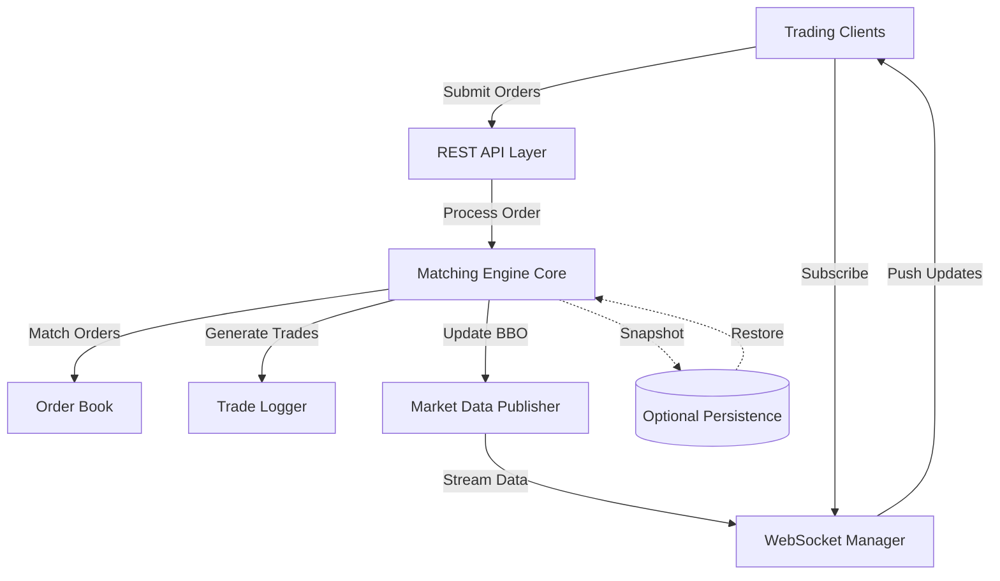

# Design Document: Cryptocurrency Matching Engine

## Overview

This document outlines the technical design for a high-performance cryptocurrency matching engine built in Python. The system implements REG NMS-inspired price-time priority matching with real-time market data dissemination. The architecture prioritizes performance, correctness, and maintainability while supporting 1000+ orders per second with sub-5ms latency.

### Technology Stack

- **Language**: Python 3.11+
- **Web Framework**: FastAPI (for REST API and WebSocket support)
- **Async Runtime**: asyncio (for concurrent WebSocket connections)
- **Data Structures**: sortedcontainers (for efficient order book management)
- **Serialization**: Pydantic (for data validation and serialization)
- **Logging**: structlog (for structured logging)
- **Testing**: pytest (for unit and integration tests)
- **Optional Persistence**: Redis or SQLite (for order book snapshots)

## Architecture

### High-Level Architecture



### Component Architecture

The system is organized into distinct layers:

1. **API Layer**: Handles HTTP/WebSocket communication
2. **Engine Layer**: Core matching logic and order processing
3. **Data Layer**: Order book and trade storage
4. **Publisher Layer**: Real-time market data dissemination

## Components and Interfaces

### 1. Order Book Component

**Purpose**: Maintains buy and sell orders organized by price-time priority

**Data Structures**:

```python
# Price Level: FIFO queue of orders at a specific price
class PriceLevel:
    price: Decimal
    orders: deque[Order]  # FIFO queue
    total_quantity: Decimal
    
# Order Book: Sorted price levels
class OrderBook:
    symbol: str
    bids: SortedDict[Decimal, PriceLevel]  # Descending order
    asks: SortedDict[Decimal, PriceLevel]  # Ascending order
    order_index: dict[str, Order]  # Fast order lookup by ID
```

**Key Operations**:
- `add_order(order)`: O(log n) - Insert order at appropriate price level
- `remove_order(order_id)`: O(log n) - Remove order from book
- `get_best_bid()`: O(1) - Return highest bid price level
- `get_best_ask()`: O(1) - Return lowest ask price level
- `get_depth(levels)`: O(k) - Return top k price levels

**Design Rationale**:
- `SortedDict` from sortedcontainers provides O(log n) insertion/deletion with O(1) access to best prices
- `deque` provides O(1) append/popleft for FIFO order processing
- Separate order index enables O(1) order lookup for cancellations

### 2. Matching Engine Component

**Purpose**: Core order processing and matching logic

**Class Structure**:

```python
class MatchingEngine:
    order_books: dict[str, OrderBook]
    trade_id_counter: int
    order_id_counter: int
    market_data_publisher: MarketDataPublisher
    trade_publisher: TradePublisher
    logger: Logger
    
    # Core methods
    def process_order(order: Order) -> OrderResult
    def match_order(order: Order, order_book: OrderBook) -> list[Trade]
    def add_to_book(order: Order, order_book: OrderBook) -> None
    def cancel_order(order_id: str, symbol: str) -> bool
```

**Matching Algorithm**:

```python
def match_order(order: Order, order_book: OrderBook) -> list[Trade]:
    """
    Match incoming order against order book using price-time priority.
    Returns list of executed trades.
    """
    trades = []
    remaining_qty = order.quantity
    
    # Get opposite side of book
    price_levels = (order_book.asks if order.side == 'buy' 
                   else order_book.bids)
    
    # Iterate through price levels in priority order
    while remaining_qty > 0 and price_levels:
        best_price = get_best_price(price_levels)
        
        # Check if order can match at this price
        if not can_match(order, best_price):
            break
            
        price_level = price_levels[best_price]
        
        # Match against orders at this price level (FIFO)
        while remaining_qty > 0 and price_level.orders:
            resting_order = price_level.orders[0]
            
            # Calculate fill quantity
            fill_qty = min(remaining_qty, resting_order.remaining_quantity)
            
            # Create trade
            trade = create_trade(
                taker_order=order,
                maker_order=resting_order,
                price=best_price,
                quantity=fill_qty
            )
            trades.append(trade)
            
            # Update quantities
            remaining_qty -= fill_qty
            resting_order.remaining_quantity -= fill_qty
            
            # Remove filled order
            if resting_order.remaining_quantity == 0:
                price_level.orders.popleft()
                
        # Remove empty price level
        if not price_level.orders:
            del price_levels[best_price]
    
    return trades
```

**Order Type Handling**:

- **Market Order**: Match against all available liquidity, cancel remainder
- **Limit Order**: Match at limit price or better, rest remainder on book
- **IOC Order**: Match available liquidity, cancel remainder (no resting)
- **FOK Order**: Check if fully fillable first, then execute atomically or cancel

### 3. Order Model

**Purpose**: Represent orders with validation

```python
class Order:
    order_id: str
    symbol: str
    order_type: OrderType  # MARKET, LIMIT, IOC, FOK
    side: Side  # BUY, SELL
    quantity: Decimal
    price: Optional[Decimal]
    timestamp: datetime
    remaining_quantity: Decimal
    status: OrderStatus  # NEW, PARTIAL, FILLED, CANCELLED
    
    def is_marketable(self, bbo: BBO) -> bool:
        """Check if order can immediately match"""
        
    def can_rest_on_book(self) -> bool:
        """Check if order type allows resting"""
```

### 4. Trade Model

**Purpose**: Represent executed trades

```python
class Trade:
    trade_id: str
    symbol: str
    price: Decimal
    quantity: Decimal
    timestamp: datetime
    maker_order_id: str
    taker_order_id: str
    aggressor_side: Side
    
    def to_dict(self) -> dict:
        """Serialize for API response"""
```

### 5. Market Data Publisher

**Purpose**: Disseminate real-time BBO and order book updates

```python
class MarketDataPublisher:
    websocket_manager: WebSocketManager
    bbo_cache: dict[str, BBO]
    
    async def publish_bbo_update(symbol: str, bbo: BBO):
        """Push BBO update to all subscribers"""
        
    async def publish_orderbook_update(symbol: str, orderbook_snapshot: OrderBookSnapshot):
        """Push L2 orderbook data to subscribers"""
        
    def calculate_bbo(order_book: OrderBook) -> BBO:
        """Calculate current best bid and offer"""
```

**BBO Calculation**:

```python
def calculate_bbo(order_book: OrderBook) -> BBO:
    best_bid = None
    best_bid_qty = Decimal(0)
    
    if order_book.bids:
        best_bid_price = order_book.bids.keys()[-1]  # Highest bid
        best_bid_level = order_book.bids[best_bid_price]
        best_bid = best_bid_price
        best_bid_qty = best_bid_level.total_quantity
    
    best_ask = None
    best_ask_qty = Decimal(0)
    
    if order_book.asks:
        best_ask_price = order_book.asks.keys()[0]  # Lowest ask
        best_ask_level = order_book.asks[best_ask_price]
        best_ask = best_ask_price
        best_ask_qty = best_ask_level.total_quantity
    
    return BBO(
        symbol=order_book.symbol,
        best_bid=best_bid,
        best_bid_quantity=best_bid_qty,
        best_ask=best_ask,
        best_ask_quantity=best_ask_qty,
        timestamp=datetime.utcnow()
    )
```

### 6. WebSocket Manager

**Purpose**: Manage WebSocket connections and subscriptions

```python
class WebSocketManager:
    connections: dict[str, set[WebSocket]]  # symbol -> subscribers
    
    async def connect(websocket: WebSocket, symbol: str):
        """Add new subscriber"""
        
    async def disconnect(websocket: WebSocket, symbol: str):
        """Remove subscriber"""
        
    async def broadcast(symbol: str, message: dict):
        """Send message to all subscribers of a symbol"""
        
    async def send_personal(websocket: WebSocket, message: dict):
        """Send message to specific connection"""
```

### 7. REST API Layer

**Purpose**: Handle order submission and queries

**Endpoints**:

```python
# Order submission
POST /api/v1/orders
Request Body:
{
    "symbol": "BTC-USDT",
    "order_type": "limit",
    "side": "buy",
    "quantity": "0.5",
    "price": "50000.00"
}

Response:
{
    "order_id": "ORD-123456",
    "status": "accepted",
    "timestamp": "2025-10-26T12:34:56.789Z"
}

# Order cancellation
DELETE /api/v1/orders/{order_id}

# Order status query
GET /api/v1/orders/{order_id}

# Order book snapshot
GET /api/v1/orderbook/{symbol}
```

### 8. WebSocket API Layer

**Purpose**: Stream real-time market data

**Endpoints**:

```python
# Market data subscription
WS /ws/market-data/{symbol}

# BBO Update Message
{
    "type": "bbo",
    "timestamp": "2025-10-26T12:34:56.789Z",
    "symbol": "BTC-USDT",
    "best_bid": "49999.50",
    "best_bid_quantity": "2.5",
    "best_ask": "50000.00",
    "best_ask_quantity": "1.8"
}

# Order Book Update Message
{
    "type": "orderbook",
    "timestamp": "2025-10-26T12:34:56.789Z",
    "symbol": "BTC-USDT",
    "bids": [
        ["49999.50", "2.5"],
        ["49999.00", "5.0"],
        ...
    ],
    "asks": [
        ["50000.00", "1.8"],
        ["50000.50", "3.2"],
        ...
    ]
}

# Trade execution subscription
WS /ws/trades/{symbol}

# Trade Execution Message
{
    "type": "trade",
    "timestamp": "2025-10-26T12:34:56.789Z",
    "symbol": "BTC-USDT",
    "trade_id": "TRD-789012",
    "price": "50000.00",
    "quantity": "0.5",
    "aggressor_side": "buy",
    "maker_order_id": "ORD-123455",
    "taker_order_id": "ORD-123456"
}
```

## Data Models

### Core Data Models

```python
from enum import Enum
from decimal import Decimal
from datetime import datetime
from pydantic import BaseModel, Field, validator

class OrderType(str, Enum):
    MARKET = "market"
    LIMIT = "limit"
    IOC = "ioc"
    FOK = "fok"

class Side(str, Enum):
    BUY = "buy"
    SELL = "sell"

class OrderStatus(str, Enum):
    NEW = "new"
    PARTIAL = "partial"
    FILLED = "filled"
    CANCELLED = "cancelled"
    REJECTED = "rejected"

class OrderRequest(BaseModel):
    symbol: str = Field(..., pattern="^[A-Z]+-[A-Z]+$")
    order_type: OrderType
    side: Side
    quantity: Decimal = Field(..., gt=0)
    price: Optional[Decimal] = Field(None, gt=0)
    
    @validator('price')
    def validate_price(cls, v, values):
        order_type = values.get('order_type')
        if order_type in [OrderType.LIMIT, OrderType.IOC, OrderType.FOK]:
            if v is None:
                raise ValueError("Price required for limit, IOC, and FOK orders")
        return v

class OrderResponse(BaseModel):
    order_id: str
    status: str
    timestamp: datetime
    message: Optional[str] = None

class BBO(BaseModel):
    symbol: str
    best_bid: Optional[Decimal]
    best_bid_quantity: Decimal
    best_ask: Optional[Decimal]
    best_ask_quantity: Decimal
    timestamp: datetime

class OrderBookSnapshot(BaseModel):
    symbol: str
    timestamp: datetime
    bids: list[tuple[str, str]]  # [price, quantity]
    asks: list[tuple[str, str]]

class TradeExecution(BaseModel):
    trade_id: str
    symbol: str
    timestamp: datetime
    price: Decimal
    quantity: Decimal
    aggressor_side: Side
    maker_order_id: str
    taker_order_id: str
```

## Error Handling

### Error Categories

1. **Validation Errors**: Invalid order parameters
2. **Business Logic Errors**: Insufficient liquidity, invalid state transitions
3. **System Errors**: Database failures, network issues
4. **Concurrency Errors**: Race conditions (mitigated by sequential processing)

### Error Handling Strategy

```python
class MatchingEngineError(Exception):
    """Base exception for matching engine errors"""
    pass

class OrderValidationError(MatchingEngineError):
    """Invalid order parameters"""
    pass

class InsufficientLiquidityError(MatchingEngineError):
    """Cannot fill FOK order"""
    pass

class OrderNotFoundError(MatchingEngineError):
    """Order ID not found"""
    pass

# Error handling in API layer
@app.post("/api/v1/orders")
async def submit_order(order_request: OrderRequest):
    try:
        result = await matching_engine.process_order(order_request)
        return OrderResponse(
            order_id=result.order_id,
            status="accepted",
            timestamp=result.timestamp
        )
    except OrderValidationError as e:
        raise HTTPException(status_code=400, detail=str(e))
    except InsufficientLiquidityError as e:
        raise HTTPException(status_code=422, detail=str(e))
    except Exception as e:
        logger.error("Unexpected error processing order", error=str(e))
        raise HTTPException(status_code=500, detail="Internal server error")
```

### Logging Strategy

```python
import structlog

logger = structlog.get_logger()

# Order submission logging
logger.info(
    "order_submitted",
    order_id=order.order_id,
    symbol=order.symbol,
    order_type=order.order_type,
    side=order.side,
    quantity=str(order.quantity),
    price=str(order.price) if order.price else None
)

# Trade execution logging
logger.info(
    "trade_executed",
    trade_id=trade.trade_id,
    symbol=trade.symbol,
    price=str(trade.price),
    quantity=str(trade.quantity),
    maker_order_id=trade.maker_order_id,
    taker_order_id=trade.taker_order_id,
    aggressor_side=trade.aggressor_side
)

# Order cancellation logging
logger.info(
    "order_cancelled",
    order_id=order_id,
    symbol=symbol,
    reason=reason
)
```

## Testing Strategy

### Unit Tests

**Order Book Tests**:
- Test order insertion at various price levels
- Test order removal and cancellation
- Test BBO calculation with various book states
- Test price-time priority enforcement
- Test edge cases (empty book, single order, etc.)

**Matching Engine Tests**:
- Test market order matching with full liquidity
- Test market order matching with partial liquidity
- Test limit order matching and resting
- Test IOC order execution and cancellation
- Test FOK order atomic execution and rejection
- Test trade-through prevention
- Test price-time priority across multiple price levels

**Order Type Tests**:
- Test each order type independently
- Test order type validation
- Test price requirement validation

### Integration Tests

**API Tests**:
- Test order submission through REST API
- Test WebSocket connection and subscription
- Test market data streaming
- Test trade execution streaming
- Test error responses

**End-to-End Tests**:
- Test complete order lifecycle (submit -> match -> execute)
- Test multiple concurrent orders
- Test order book state consistency
- Test market data accuracy

### Performance Tests

**Latency Tests**:
- Measure order processing latency (target: <5ms average)
- Measure BBO update latency (target: <1ms)
- Measure trade dissemination latency (target: <1ms)

**Throughput Tests**:
- Test sustained order rate (target: 1000+ orders/sec)
- Test peak order rate handling
- Test WebSocket broadcast performance with multiple subscribers

**Load Tests**:
- Test system behavior under sustained high load
- Test memory usage with large order books
- Test CPU usage under various workloads

### Test Data Generation

```python
# Generate realistic test orders
def generate_test_orders(count: int, symbol: str) -> list[Order]:
    """Generate random orders around a base price"""
    base_price = Decimal("50000")
    orders = []
    
    for i in range(count):
        side = random.choice([Side.BUY, Side.SELL])
        order_type = random.choice(list(OrderType))
        
        # Generate price with spread
        if side == Side.BUY:
            price = base_price - Decimal(random.uniform(0, 100))
        else:
            price = base_price + Decimal(random.uniform(0, 100))
        
        orders.append(Order(
            order_id=f"TEST-{i}",
            symbol=symbol,
            order_type=order_type,
            side=side,
            quantity=Decimal(random.uniform(0.1, 10)),
            price=price if order_type != OrderType.MARKET else None,
            timestamp=datetime.utcnow()
        ))
    
    return orders
```

## Performance Optimization

### Data Structure Optimization

1. **SortedDict for Price Levels**: O(log n) operations with O(1) best price access
2. **Deque for Order Queues**: O(1) FIFO operations
3. **Dict for Order Index**: O(1) order lookup by ID
4. **Decimal for Prices**: Precise financial calculations without floating-point errors

### Algorithm Optimization

1. **Early Termination**: Stop matching when price conditions not met
2. **Lazy BBO Calculation**: Only recalculate when top of book changes
3. **Batch Market Data Updates**: Aggregate updates before broadcasting
4. **Pre-allocated Buffers**: Reuse objects to reduce GC pressure

### Concurrency Strategy

**Sequential Processing Model**:
- Process orders sequentially in a single thread/coroutine
- Eliminates race conditions and ensures deterministic matching
- Simplifies testing and debugging
- Sufficient for 1000+ orders/sec target

**Async I/O for Network**:
- Use asyncio for WebSocket connections
- Non-blocking I/O for API responses
- Separate I/O operations from matching logic

```python
class MatchingEngine:
    def __init__(self):
        self.order_queue = asyncio.Queue()
        self.running = False
    
    async def start(self):
        """Start order processing loop"""
        self.running = True
        while self.running:
            order = await self.order_queue.get()
            await self._process_order_internal(order)
    
    async def submit_order(self, order: Order) -> OrderResult:
        """Add order to processing queue"""
        result_future = asyncio.Future()
        await self.order_queue.put((order, result_future))
        return await result_future
```

### Memory Optimization

1. **Order Cleanup**: Remove filled orders from memory
2. **Trade History Limits**: Archive old trades to persistent storage
3. **Connection Limits**: Cap maximum WebSocket connections
4. **Order Book Depth Limits**: Optionally limit price levels stored

## Project Structure

```
crypto-matching-engine/
├── README.md
├── requirements.txt
├── setup.py
├── .env.example
├── .gitignore
├── Dockerfile
├── docker-compose.yml
│
├── src/
│   └── matching_engine/
│       ├── __init__.py
│       ├── main.py                 # Application entry point
│       │
│       ├── core/
│       │   ├── __init__.py
│       │   ├── engine.py           # MatchingEngine class
│       │   ├── order_book.py       # OrderBook and PriceLevel classes
│       │   ├── models.py           # Order, Trade, BBO models
│       │   └── exceptions.py       # Custom exceptions
│       │
│       ├── api/
│       │   ├── __init__.py
│       │   ├── app.py              # FastAPI application
│       │   ├── routes.py           # REST endpoints
│       │   ├── websocket.py        # WebSocket endpoints
│       │   ├── schemas.py          # Pydantic request/response models
│       │   └── dependencies.py     # Dependency injection
│       │
│       ├── publishers/
│       │   ├── __init__.py
│       │   ├── market_data.py      # MarketDataPublisher
│       │   ├── trade.py            # TradePublisher
│       │   └── websocket_manager.py # WebSocketManager
│       │
│       ├── persistence/
│       │   ├── __init__.py
│       │   ├── snapshot.py         # Order book snapshots
│       │   └── trade_log.py        # Trade history storage
│       │
│       └── utils/
│           ├── __init__.py
│           ├── logging.py          # Logging configuration
│           ├── config.py           # Configuration management
│           └── validators.py       # Input validation utilities
│
├── tests/
│   ├── __init__.py
│   ├── conftest.py                 # Pytest fixtures
│   │
│   ├── unit/
│   │   ├── test_order_book.py
│   │   ├── test_matching_engine.py
│   │   ├── test_order_types.py
│   │   └── test_models.py
│   │
│   ├── integration/
│   │   ├── test_api.py
│   │   ├── test_websocket.py
│   │   └── test_end_to_end.py
│   │
│   └── performance/
│       ├── test_latency.py
│       ├── test_throughput.py
│       └── benchmark.py
│
├── scripts/
│   ├── generate_test_data.py
│   ├── run_benchmarks.py
│   └── simulate_trading.py
│
└── docs/
    ├── api_reference.md
    ├── architecture.md
    └── deployment.md
```

## Deployment Considerations

### Docker Configuration

```dockerfile
FROM python:3.11-slim

WORKDIR /app

COPY requirements.txt .
RUN pip install --no-cache-dir -r requirements.txt

COPY src/ ./src/

EXPOSE 8000

CMD ["uvicorn", "matching_engine.api.app:app", "--host", "0.0.0.0", "--port", "8000"]
```

### Environment Configuration

```python
# config.py
from pydantic import BaseSettings

class Settings(BaseSettings):
    # API Configuration
    api_host: str = "0.0.0.0"
    api_port: int = 8000
    
    # Performance Configuration
    max_websocket_connections: int = 1000
    order_queue_size: int = 10000
    
    # Logging Configuration
    log_level: str = "INFO"
    log_format: str = "json"
    
    # Persistence Configuration
    enable_persistence: bool = False
    snapshot_interval_seconds: int = 60
    
    class Config:
        env_file = ".env"
```

### Monitoring and Metrics

```python
# Key metrics to track
- orders_processed_total (counter)
- order_processing_latency_seconds (histogram)
- trades_executed_total (counter)
- active_websocket_connections (gauge)
- order_book_depth (gauge)
- bbo_update_latency_seconds (histogram)
- api_request_duration_seconds (histogram)
```

## Real-Time Data Integration

### Market Data Simulation

For testing and demonstration, implement a market data simulator:

```python
class MarketDataSimulator:
    """Generate realistic order flow for testing"""
    
    async def simulate_trading_activity(
        self,
        engine: MatchingEngine,
        symbol: str,
        orders_per_second: int,
        duration_seconds: int
    ):
        """Generate random orders at specified rate"""
        interval = 1.0 / orders_per_second
        
        for _ in range(orders_per_second * duration_seconds):
            order = self._generate_random_order(symbol)
            await engine.submit_order(order)
            await asyncio.sleep(interval)
    
    def _generate_random_order(self, symbol: str) -> Order:
        """Generate realistic order based on current market"""
        # Implementation details...
```

### External Data Integration (Future Enhancement)

For production use with real market data:

```python
class ExternalDataFeed:
    """Integrate with external price feeds"""
    
    async def subscribe_to_feed(self, symbol: str):
        """Subscribe to external market data"""
        
    async def process_external_tick(self, tick: MarketTick):
        """Process incoming market data and generate orders"""
```

## Security Considerations

1. **Input Validation**: Strict validation of all order parameters
2. **Rate Limiting**: Prevent order spam and DoS attacks
3. **Authentication**: API key or JWT-based authentication for order submission
4. **WebSocket Authentication**: Token-based WebSocket connection authentication
5. **Order Limits**: Maximum order size and value limits
6. **Audit Logging**: Comprehensive logging of all actions for compliance

## Future Enhancements

1. **Advanced Order Types**: Stop-loss, stop-limit, take-profit, iceberg orders
2. **Multi-Symbol Support**: Efficient handling of multiple trading pairs
3. **Order Modification**: Support for order amendments
4. **Maker-Taker Fees**: Fee calculation and reporting
5. **Position Tracking**: Track user positions and balances
6. **Risk Management**: Pre-trade risk checks and position limits
7. **Market Making**: Built-in market maker bots for liquidity
8. **Historical Data API**: Query historical trades and order book snapshots
9. **Clustering**: Horizontal scaling with order routing
10. **Persistence**: Full order book and trade history persistence with recovery
